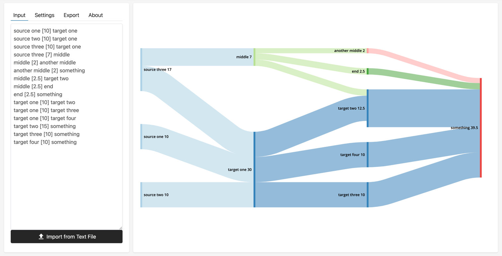

# SankeyDiagram.net

## About
SankeyDiagram.net is a simple and modern generator for Sankey Diagrams.  

Live Version: [https://sankeydiagram.net/](https://sankeydiagram.net/)  
Example Diagram: [https://sankeydiagram.net/?content=PTAEGUHkFUCUGECioD...](https://sankeydiagram.net/?content=PTAEGUHkFUCUGECioDaA1AggGWsgFAMYCGAdqAEYCmoRoA5APx0CUAuqACoawDiiHoPCniQskWK2YAoAO5EA5tRQBmAAyr2AFyIAPSgGdZCpQ3YAbAJYA3CyXlTLNu6gDs69gCdKJTQ+u35VAAmd1AAV00LS0iDPydAlQ1QW01KDxJKXzlFVFNkkisDSLspW0L9YoS8/gAxQ1r9VABGAFYk8AAyAAU21SkG5rb2RDCPAHtwTTGdHTbSgqKA3PYKsYIAa0NVjcaUIdAAEg5wLAwjHJQ871SPbVsAW2upa7S7kkefZdB7sfIo6nkREehh+fzMAKBBkGSQIZiI+gAFqAxgAzUCw0gg37/UCA4GofbEEgAEwAnuiPGFEc8fK8iA9rs1QpRCp9IhtMoZsiYVmFyPoCB4LAAHSJjEhbPkCoWiizi3ZNJJAogAL3FoGFQseUn0UsFIrFEqZ7AymhRlh0Or1MsNCqS+mFY0iKNJVv5+tl8q+moMhh9+l2IS0COolAI4rG9wsFXOPNAiLGwuFAR1CMTyecKFaSRRYzGxNT6aWexhZidCJTCaTxcVSQ8pGJkeSqXu+iAA=)

## Develop
* run dev-server: `npm run start`
* build: `npm run build`
* lint: `npm run lint`
* fix codestyle: `npm run lint:fix`

Live version of the dev branch: https://dev.sankeydiagram-net.pages.dev/

## Contact
If you have any questions, need help, a special license, or something else, you can contact me via GitHub Issues, or using the following methods:
* mail: [jonas@jonasdoesthings.com](mailto:jonas@jonasdoesthings.com)
* web: [jonasdoesthings.com](https://jonasdoesthings.com/)

## Credits
### Major Libraries Used
* The Sankey Diagram D3 extension is based on https://github.com/ricklupton/d3-sankey-diagram
* D3 - https://github.com/d3/d3
* For exporting images - https://github.com/exupero/saveSvgAsPng
* For copying to the user's clipboard - https://github.com/zenorocha/clipboard.js
* For compressing the sharing URL - https://github.com/pieroxy/lz-string

## License
(See [LICENSE.md](LICENSE.md))

This piece of software is licensed under the MIT with a Common Clause. That basically means, that you are allowed to view, edit, fork, this project, but not sell it.
(No legal advice)

If you want to use this project and need special licensing, contact me.
